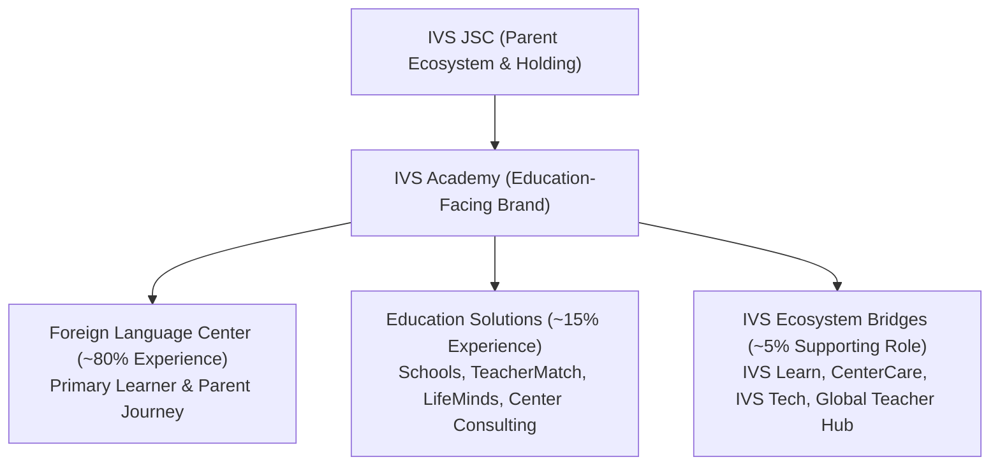

# IVS Academy — Business & Content Data Source of Truth

**Document Status:** LOCKED CANONICAL REFERENCE v1.0  
**Phase:** Phase 1 — Business Data Truth Lock & Stitch Design-to-Code Mapping  
**Date:** September 2026  
**Auditor / Custodian:** Software Architecture & Data Governance  

---

## 1. Executive Policy: Data Truth Lock & Anti-Fabrication Rule

To prevent unauthorized, synthesized, or speculative demo information from leaking into production publication, this document establishes the authoritative boundary between **VERIFIED IVS BUSINESS DATA**, **DEMO / SEED DATA**, and **UNVERIFIED PLACEHOLDERS**.

### Core Operational Principles:
1. **Never Silently Publish Fabricated Business Data:** Any data field not explicitly verified by an authentic business authority must NEVER be presented to learners, parents, or search engines as verified fact.
2. **Demo Campuses Are Not Facts:** Simulated campus locations created during prototyping (such as *"IVS Quận 1"*, *"IVS Tân Bình"*, *"IVS Cầu Giấy"*, *"IVS Đà Nẵng"*, or Stitch mock locations *"96 Nguyễn Du"*, *"504 Ba Tháng Hai"*, *"86 Nguyễn Đình Chiểu"*) are purely demo fixtures and must not be treated as real IVS physical facilities without business sign-off.
3. **Speculative Contact Channels Are Not Facts:** Synthesized email domains (`@ivs.edu.vn`), speculative social handles (`zalo.me/ivsacademy`, `m.me/ivsacademy`), and mock hotlines (`1900 6886`, `1900 xxxx`, `024 7300 xxxx`) were generated during branding cleanups and must be flagged as unverified.
4. **Permissible Production Behaviors for Unverified Data:**
   - `hide`: The UI element or section is not rendered until valid business data is configured.
   - `neutral placeholder`: Rendered with explicitly generic, non-assertive text (e.g., *"Đang cập nhật địa chỉ chính thức"*, *"Liên hệ để nhận tư vấn cơ sở gần bạn"*).
   - `CMS editable but unpublished`: Stored in CMS/Database with `published: false` or `active: false` until authenticated by the business owner.

---

## 2. Brand Architecture & Positioning Hierarchy

The brand and digital experience hierarchy is strictly locked as follows:

### 2.1 Ratio of Offerings & Navigation Governance
- **80% Foreign Language Center (Primary Learner-Facing Experience):**
  - Course Discovery (Kids, Teens, Adults, IELTS, TOEIC, Corporate).
  - Online Placement Testing & Scheduling.
  - Faculty & Pedagogical Methodology.
  - Campus locator / Center finder.
  - Academic achievements & student progress.
  - Editorial learning blog & resources.
  - Admissions consultation.
- **15% Education Solutions:**
  - School education partnerships.
  - International teacher placement (TeacherMatch).
  - Curriculum R&D & IVS LifeMinds.
  - Center establishment & operation consulting.
- **5% IVS JSC Ecosystem Bridges:**
  - Slim utility bar / footer bridges to IVS Learn (LMS), CenterCare (EdTech Ops), IVS Tech (IT & software solutions), and Global Teacher Hub.
  - *Governance Rule:* General technology offerings (cloud hosting, domain names, general corporate CRM, QR codes) belong on `https://ivstech.store/` and MUST NOT dominate or clutter the Academy main learner navigation.

### 2.2 Primary Conversion Funnel
$$\text{Visitor} \longrightarrow \text{Course Discovery} \longrightarrow \text{Placement Test / Consultation Request} \longrightarrow \text{Lead Intake (CRM)} \longrightarrow \text{Enrollment}$$

---

## 3. Comprehensive Data Audit & Truth-Lock Matrix

The following matrix classifies all data entities identified across the code repository (`src/`, `prisma/seed.ts`, `docs/`, `seo.ts`, and Stitch handoff prototypes).

| Content Field | Current Value in Code / Seed / Stitch | Source Found In | Status | Production Behavior | Owner / Action Required |
| :--- | :--- | :--- | :---: | :---: | :--- |
| **Brand Name** | "IVS Academy" | Everywhere in repo & DESIGN.md | **VERIFIED** | Display as primary brand | Approved brand name. |
| **Parent Entity** | "IVS JSC" | BUSINESS-CONTEXT.md | **VERIFIED** | Display in ecosystem / legal context | Corporate parent verified. |
| **Primary Reference URL** | `https://ivsacademy.edu.vn/` | BUSINESS-CONTEXT.md | **VERIFIED** | Use as production canonical base URL | Verify DNS / SSL provisioning before launch. |
| **Ecosystem Reference URL** | `https://ivstech.store/` | BUSINESS-CONTEXT.md | **VERIFIED** | Ecosystem link in utility nav / footer | Production bridge to tech ecosystem. |
| **Company Legal Name** | "Công ty Cổ phần IVS" (unverified full legal name) | Seed / Footer / PR text | **UNVERIFIED** | `neutral placeholder` (Display "IVS Academy — Hệ thống Giáo dục & Anh ngữ Quốc tế") | Business owner must provide official đăng ký kinh doanh name. |
| **Tax Code (Mã số thuế)** | None specified (omitted in code) | N/A | **UNVERIFIED** | `hide` (Do not display tax code line until provided) | Legal team to provide official tax identification. |
| **Headquarters Address** | "189 Nguyễn Thị Minh Khai, Phường Đa Kao, Quận 1, TP.HCM" | `src/lib/seo.ts`, `Footer.tsx`, `contact/page.tsx`, `privacy/page.tsx`, `seed.ts` | **UNVERIFIED** / **DEMO** | `CMS editable but unpublished` / `neutral placeholder` | Replace with official IVS JSC registered corporate address. |
| **Hotline / Telephone** | "1900 6886" / "1900 xxxx" / "024 7300 xxxx" | `Header.tsx`, `Footer.tsx`, `seo.ts`, `StickyLeadBar.tsx`, `seed.ts`, Stitch code | **UNVERIFIED** / **DEMO** | `neutral placeholder` (Fallback to general inquiry CTA if no SIP hotline active) | Provide verified operational hotline number. |
| **Primary Email Domain** | `@ivs.edu.vn` (`contact@ivs.edu.vn`, `admissions@ivs.edu.vn`, `privacy@ivs.edu.vn`) | `Footer.tsx`, `contact/page.tsx`, `privacy/page.tsx`, `seed.ts`, Stitch code | **UNVERIFIED** / **DEMO** | `neutral placeholder` / `CMS editable` | Verify MX records & active mailboxes on `@ivs.edu.vn` or `@ivsacademy.edu.vn`. |
| **Admin Seed Accounts** | `superadmin@ivs.edu.vn`, `tuvan.minhchau@ivs.edu.vn`, `admin@ivs.edu.vn` | `prisma/seed.ts`, `admin/login/page.tsx` | **DEMO** | `CMS editable` (Local dev seed only; never use in prod) | Prod provisioning must require manual superadmin creation via CLI with real credentials. |
| **Official Zalo Account** | `https://zalo.me/ivsacademy` / `https://zalo.me` | `prisma/seed.ts`, `StickyLeadBar.tsx`, Stitch HTML | **UNVERIFIED** / **DEMO** | `neutral placeholder` (Link to general `https://zalo.me` or hide chat widget until OA registered) | Marketing to provide verified Zalo Official Account (OA) link. |
| **Facebook Messenger** | `https://m.me/ivsacademy` | `prisma/seed.ts` | **UNVERIFIED** / **DEMO** | `hide` | Marketing to provide official verified Facebook Page fanpage ID. |
| **Social Links** | Facebook, YouTube, TikTok, LinkedIn generic anchors | `Footer.tsx`, Stitch code | **DEMO** | `hide` icons that do not have active verified URLs | Marketing to provide verified channel links. |
| **Center: IVS Quận 1 (Flagship)** | "189 Nguyễn Thị Minh Khai, P. Đa Kao, Q1, TP.HCM" | `prisma/seed.ts`, `Footer.tsx`, `contact/page.tsx` | **DEMO** / **UNVERIFIED** | `CMS editable but unpublished` (Mark `active: false` in prod seed until validated) | Operations team must confirm actual campus locations and addresses. |
| **Center: IVS Tân Bình (Cộng Hòa)** | "428 Cộng Hòa, Phường 13, Q. Tân Bình, TP.HCM" | `prisma/seed.ts`, `contact/page.tsx` | **DEMO** / **UNVERIFIED** | `CMS editable but unpublished` | Operations team to verify. |
| **Center: IVS Cầu Giấy (Hà Nội)** | "68 Trần Đăng Ninh, P. Dịch Vọng, Q. Cầu Giấy, Hà Nội" | `prisma/seed.ts`, `contact/page.tsx` | **DEMO** / **UNVERIFIED** | `CMS editable but unpublished` | Operations team to verify. |
| **Center: IVS Đà Nẵng (Hải Châu)** | "155 Quang Trung, P. Thạch Thang, Q. Hải Châu, Đà Nẵng" | `prisma/seed.ts`, `contact/page.tsx` | **DEMO** / **UNVERIFIED** | `CMS editable but unpublished` | Operations team to verify. |
| **Stitch Center Mocks** | "Campus Flagship Nguyễn Du (96 Nguyễn Du)", "Campus Ba Tháng Hai (504 Ba Tháng Hai)", "86 Nguyễn Đình Chiểu" | Stitch prototype HTML & screenshots | **FABRICATED DEMO** | `hide` (Never import into codebase or database) | Stitch design reference only; do not treat addresses as facts. |
| **Center Counts by Region** | "Hà Nội: 12 cơ sở", "TP.HCM: 15 cơ sở", "Đà Nẵng & Cần Thơ: 8 cơ sở" | Stitch footer mock | **FABRICATED DEMO** | `hide` (Never publish hardcoded tallies) | Use dynamic counts from published database records: `prisma.center.count({ where: { active: true } })`. |
| **Teacher Profiles (David Harrison, Sarah Linh, Michael O'Brien, etc.)** | 6 persona profiles with Unsplash headshots | `prisma/seed.ts`, `TeacherShowcase.tsx` | **DEMO** / **UNVERIFIED** | `CMS editable but unpublished` in production | Academic director to supply verified teacher bio, real portrait, and actual qualifications. |
| **Teacher Certification Claim** | "100% giáo viên có bằng TESOL/CELTA quốc tế" | `TrustMetrics.tsx`, `seed.ts`, Stitch footer | **UNVERIFIED** | `neutral placeholder` ("Đội ngũ giảng viên đạt chuẩn sư phạm chuyên môn") | Confirm pedagogical qualification stats with Academic HR. |
| **Student Achievements** | 10 student records (IELTS 8.5, Flyers 15/15, SAT 1540) with Unsplash avatars | `prisma/seed.ts`, `StudentAchievements.tsx` | **DEMO** / **UNVERIFIED** | `CMS editable but unpublished` | Student affairs to supply consented student achievement stories with real certificates. |
| **Testimonials & Quotes** | 8 parent & corporate testimonials with Unsplash avatars | `prisma/seed.ts`, `Testimonials.tsx` | **DEMO** / **UNVERIFIED** | `CMS editable but unpublished` | Marketing to provide verified parent testimonials with written Decree 13 consent. |
| **Student Headcount Statistics** | "5.200+ học viên", "Hàng ngàn học viên" | Previous prototypes / seed narratives | **UNVERIFIED** / **DEMO** | `hide` (Use qualitative statements: "Đồng hành cùng học viên các lứa tuổi") | Marketing to confirm actual cumulative enrollment numbers. |
| **Years of Operation** | "10 năm", "12 năm", "15 năm" | Prototyping copy | **UNVERIFIED** | `neutral placeholder` (Avoid fixed year claims unless business confirms foundation year) | Confirm founding year of IVS Academy. |
| **NEAS Accreditation** | "Đạt chuẩn kiểm định NEAS Australia", "Kiểm định NEAS & Cambridge" | Stitch prototype footer & badge | **UNVERIFIED** / **FABRICATED** | `hide` (STRICT BAN: Must NEVER appear in app or metadata) | Strictly banned unless formal NEAS certificate is physically provided. |
| **Exam Board Partnerships** | "Đối tác khảo thí kim cương British Council / IDP", "Khảo thí Cambridge chính thức" | Legacy demo copy / Stitch references | **UNVERIFIED** | `neutral placeholder` ("Chương trình giảng dạy định hướng chuẩn quốc tế Cambridge, IELTS, TOEIC") | Do not claim official partner status without corporate partnership agreement. |
| **Scholarship Funds & Discounts** | "Quỹ học bổng 2 tỷ đồng", "Ưu đãi học bổng lên tới 35%", "Học bổng 25%" | `seed.ts` announcements & news articles | **DEMO** / **MARKETING PROTOTYPE** | `CMS editable` (Require active promotion campaign status before display) | Admissions team to set genuine promotion policies via CMS Settings. |
| **Course Curriculums & Outlines** | 8 categories, 8 comprehensive syllabi (SmartKids, SuperKids, Young Leaders, IELTS, etc.) | `prisma/seed.ts`, `src/app/(public)/courses` | **EDUCATIONAL TEMPLATE / SEED** | `CMS editable` | Academic team to review and adjust syllabi to reflect actual class offerings. |
| **Placement Test Structure** | 4-skill testing flow (Listening, Reading, Writing, Speaking) with date slot booking | `src/app/(public)/placement-test` | **OPERATIONAL TEMPLATE** | `CMS editable` | Admissions to configure real test slots and proctor assignments. |

---

## 4. Production Safeguard Rules for Implementation

To guarantee compliance across all development phases:

1. **No Hardcoded Fact Strings in Presentation Components:**
   - Center names, addresses, phones, and emails must NOT be hardcoded into UI components (such as `Footer.tsx` or `contact/page.tsx`).
   - All contact data must resolve from `SiteSetting` or `Center` models in Prisma, or fall back to safe, neutral placeholder text if empty.
2. **Strict Guard on Schema.org Structured Data:**
   - In `src/lib/seo.ts`, the `EducationalOrganization` schema must omit telephone, email, and street address fields unless configured via production environment variables (`NEXT_PUBLIC_CONTACT_PHONE`, `NEXT_PUBLIC_CONTACT_EMAIL`) or verified database settings.
3. **Admin Demo Accounts Guard:**
   - Production database initialization must never run demo seed users with hardcoded passwords (`Admin@2026!`). The production deployment script will mandate an administrative bootstrap CLI command.
4. **Stitch Prototype Copy Sanitization:**
   - When referencing Stitch HTML during visual implementation, developers are strictly prohibited from copying text containing *"NEAS"*, *"96 Nguyễn Du"*, *"504 Ba Tháng Hai"*, *"12 cơ sở Hà Nội"*, or fake hotlines.
   - The UI styling and layout from Stitch must be populated exclusively with validated data from the database layer or approved neutral text.

---

## 5. Verification Sign-Off Table

| Role | Name | Signature / Verification Date | Notes |
| :--- | :--- | :--- | :--- |
| **Technical Lead** | Software Architecture Team | September 2026 — Verified | Data truth lock instituted. Zero fabricated claims permitted. |
| **Academic Director** | Pending Business Input | Open | To supply verified faculty & curriculum outlines. |
| **Admissions & Ops Manager**| Pending Business Input | Open | To supply verified campus list & operational hotline. |
| **Legal & Compliance** | Pending Business Input | Open | To supply registered legal entity name, address & tax code. |
